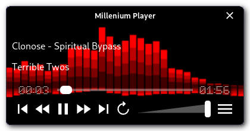

Millenium Player [](https://github.com/jdisanti/millenium-player/actions/workflows/ci.yml)
================

A free and open, lean, highly cross-platform, music player.



Millenium Player is very new, unstable, alpha software.
It currently works on Linux, Windows, and MacOS. iOS and Android support
are desired, but not yet in progress.

Guiding Principles
------------------

Millenium Player strives to:

- **Run on as many platforms as practical:** Use the same music playing software everywhere.
- **Be lean and mean:** The software must be small and portable (installers optional). It should also be as efficient as possible to reduce power use.
- **Support common audio formats:** Obscure formats might be supported, but this player does not strive to play everything.
- **Be easy to build and contribute to:** The player should have easy to follow code and an easy to setup and use build system to encourage contributions. As much as possible, it should strive to use a single programming language throughout.

In the future, Millenium Player will have music library management features. When this is the case,
Millenium Player will _not_ modify any of the files in the music library without requesting permission
from the user.

Building
--------

### Prerequisites

You will need to install the following:
- [The Rust compiler](https://rustup.rs/)
- [Trunk](https://crates.io/crates/trunk): You can use `cargo install trunk` once Rust is installed. Alternatively,
on MacOS, it is available in Homebrew as `trunk`.
- [Just](https://github.com/casey/just): You can use `cargo install just` to install it, or follow their install instructions.

### Linux Prerequisites

A number of development libraries are required to compile on Linux:
- GCC
- The ALSA library
- GTK 3
- WebKit 2 for GTK
- XDO

On Debian or Ubuntu systems, these can be installed with:

```bash
sudo apt-get install build-essential libasound2-dev libgtk-3-dev libwebkit2gtk-4.1-dev libxdo-dev
```

Know how to install these on other distributions? Please open a pull request to update this README!

### Windows Prerequisites

The Rust compiler will require either Microsoft Visual Studio or MinGW. The setup process should have
instructions on how to acquire these.

### MacOS Prerequisites

Xcode, or the Xcode command-line tools, are required in order to provide necessary system libraries.

### Building

Once all the prerequisites are installed, building is as simple as running:
```
just build
```

To get a release build, run:
```
just release
```

The resulting binary will be in _target/debug_ for `just build`, and in _target/release_ for `just release`.

If you want to quickly see the player in action, you can run:
```
just run-hydrate
```
This will start up the player playing test-data/hydrate/hydrate.mp3.

Have a look at the [`justfile`](./justfile) for more build targets.

Discussion
----------

There is a [Discord server](https://discord.gg/Ga3nV7KHcK) for discussing Millenium Player.
Ask questions, report issues, and talk about development and contributions there.

Contributing
------------

Contributions are welcome, and thank you for your interest in contributing!
See [the contributing guide](./CONTRIBUTING.md) for information on how to contribute.

License
-------

The Millenium Player source code is licensed under the GPL-3.0, and a copy of the license is
availabe in the [COPYING](./COPYING) file.

Several assets in the repository are under different licenses, and when this is the case, there is
a LICENCE, COPYING, or ATTRIBUTION file present in the directory of the asset, and potentially a README
explaining where the asset originated from. Assets that do not have an accompanying LICENSE, COPYING,
or ATTRIBUTION file alongside them are licensed as GPL-3.0.
